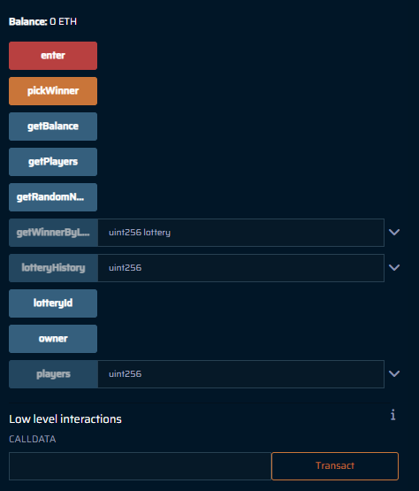

# 🎲 Lottery Smart Contract

 <!-- Placeholder link; replace with actual image link -->

> A decentralized lottery application where users can enter by sending a small amount of ETH. The contract owner can pick a winner randomly, and the prize pool is awarded to the winner.

## Overview

The `Lottery` smart contract allows multiple users to enter a lottery game by sending ETH. At any time, the contract owner can select a winner randomly, and the entire balance of the contract is transferred to that winner. The contract maintains a history of winners for each lottery round.

## Table of Contents

1. [Getting Started](#getting-started)
2. [Contract Details](#contract-details)
   - [State Variables](#state-variables)
   - [Constructor](#constructor)
   - [Functions](#functions)
3. [Security & Limitations](#security--limitations)
4. [License](#license)

---

## Getting Started

1. **Install Dependencies**: Ensure you have MetaMask or a similar wallet connected to a test Ethereum network (e.g., Rinkeby or Goerli) for deploying and interacting with the contract.
2. **Deploy the Contract**: Use Remix IDE or Hardhat to deploy the contract. Set the initial contract owner as the address deploying it.

## Contract Details

### State Variables

1. **owner** (`address`): Stores the contract owner’s address.
2. **players** (`address payable[]`): Array to keep track of participants in the lottery.
3. **lotteryId** (`uint`): Lottery ID that increments with each round.
4. **lotteryHistory** (`mapping(uint => address payable)`): Records the winners for each lottery round.

### Constructor

The contract sets the deploying address as the owner and initializes the first lottery round (lotteryId = 1).

### Functions

#### `enter()`
- Allows a player to join the lottery by sending a minimum amount of **0.01 ETH**.
- **Requirements**: `msg.value` must be greater than 0.01 ETH.

#### `getWinnerByLottery(uint lottery)`
- Fetches the winner of a specified lottery round from the history.
- **Parameters**: `lottery` - the lottery round ID.
- **Returns**: Address of the winner for that round.

#### `getBalance()`
- Returns the current ETH balance of the contract.

#### `getPlayers()`
- Returns the list of players who joined the current lottery round.

#### `getRandomNumber()`
- Generates a pseudo-random number based on the `owner` address and `block.timestamp`.
- Used internally to help pick a random winner.

#### `pickWinner()`
- **Access Restriction**: Only the contract owner can call this function.
- Selects a random winner and transfers the entire contract balance to that player.
- Saves the winner’s address in `lotteryHistory` with the current `lotteryId`, then increments `lotteryId` for the next round.

#### Modifier: `onlyowner()`
- Restricts certain functions to the contract owner.

### Contract Workflow

1. **Joining the Lottery**: Players call `enter()` and pay a small ETH fee to join.
2. **Picking a Winner**: Only the contract owner can trigger `pickWinner()` to randomly select a winner.
3. **Awarding the Prize**: The contract’s balance is transferred to the winner.
4. **Recording the Winner**: The winner’s address is saved in `lotteryHistory`.

## Security & Limitations

- **Pseudo-randomness**: This contract uses `keccak256` with `block.timestamp`, which is not entirely secure for randomness. Consider using Chainlink VRF for better randomness.
- **Owner Control**: Only the owner can pick a winner, so it's crucial to ensure the owner is trustworthy.
- **Gas Fees**: With a high number of players, `pickWinner()` could incur high gas costs.

## License

This project is licensed under the MIT License. See the `LICENSE` file for more details.
